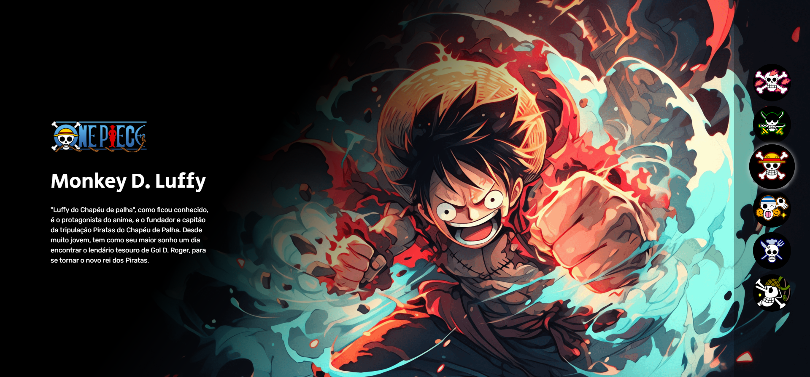

# Projeto One Piece

- Site que descreve o elenco principal de One Piece.

## Demonstração


* [ver o site do projeto](https://gkptan.github.io/projeto-one-piece/)

## Estrutura do projeto

```
projeto-one-piece/
├── index.html
└── src/
    ├── css/
    │   ├── estilos.css
    │   ├── reset.css
    │   └── responsivo.css
    ├── imagens/
    │   ├── Franky.png
    │   ├── Nico Robin.png
    │   ├── Tripulação Franky.png
    │   ├── Tripulação Robin.png
    │   ├── Tripulação Usopp.png
    │   ├── Usopp.png
    │   ├── one-piece-logo.png
    │   ├── personagem-monkey-d-luffy.png
    │   ├── personagem-nami.png
    │   ├── personagem-roronoa-zoro.png
    │   ├── personagem-sanji.png
    │   ├── personagem-tony-chopper.png
    │   ├── tripulacao-chopper.png
    │   ├── tripulacao-luffy.png
    │   ├── tripulacao-nami.png
    │   ├── tripulacao-sanji.png
    │   └── tripulacao-zoro.png
    └── js/
        └── index.js
```

## Tecnologias utilizadas

- HTML
- CSS
- JavaScript

## Aprendizados

- Estruturação de um projeto web.
- Utilização de HTML para criar a estrutura do site.
- Estilização do site utilizando CSS.
- Manipulação do DOM com JavaScript para adicionar interatividade.
- Responsividade do site para diferentes dispositivos.
- Organização de arquivos e pastas em um projeto web.
- Uso de imagens para enriquecer o conteúdo do site.
- Desenvolvimento de um projeto completo do início ao fim.
- Primeiro contato com o desenvolvimento web, aplicando conhecimentos básicos de HTML, CSS e JavaScript.

## Problemas e Bugs

- Se tiver encontrado algum bug ou problema, sinta-se à vontade para abrir uma issue com os detalhes ou corrigir o problema.

## Autor
- Guilherme Amorim
* [Linkedin](https://www.linkedin.com/in/guilherme-dos-santos-amorim-43b57a28b/)
* [Portfólio](https://gkptan.github.io/)